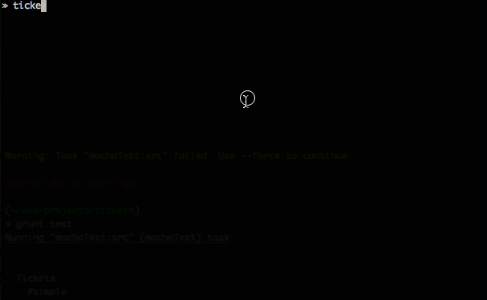

# Tickets [](http://gruntjs.com/)

A [node.js](http://nodejs.org/) API module and CLI for searching your code for comments referencing [JIRA](https://www.atlassian.com/software/jira) tickets and looking up their current status.

## Usage

I use tickets after each new release of Appcelerator's [Titanium](http://www.appcelerator.com/titanium/) to see if it fixes issues I have worked around in my code. This is also where the defaults for this module come from. However, you can override any of them easily via the listed [options](#options).

## Example

A screencast showing the CLI in action:




## Install [](http://badge.fury.io/js/tickets)

```
$ sudo npm install -g tickets
```

## Options

Type `tickets -h` to see the options:

```
-d, --dir <value>         directory to search in [default: process.cwd()]
-e, --extensions <items>  comma-separated list of file extensions or + for all
                          [default: js,jmk,tss,xml]]
-k, --keys <items>        comma-separated list of JIRA project keys or + for all
                          [default: TIMOB,ALOY]
-j, --jira <value>        url of the JIRA install to query
                          [default: https://jira.appcelerator.org/]
-u, --username <value>    optional username to login to JIRA
-p, --password <value>    optional password to login to JIRA
```

### API

You can also use tickets as a module. It exports just a single function which you can call with an object containing any of the options and a callback to receive the error or found issues.

An example [inspired](https://github.com/FokkeZB/tickets/issues/1) by @manumaticx to use as a Grunt task:

```
grunt.registerTask('tickets', 'Checking for referenced JIRA tickets that are closed', function() {
  var done = this.async(),
    tickets = require('tickets');

  tickets({
    dir: 'app',
    extensions: 'js,tss,xml', // takes both CSV and
    keys: ['ALOY', 'TC'] // Array

  }, function(err, issues) {

    if (err) {
      grunt.log.error(err);
    } else {
      issues.forEach(function(issue) {
        if (!issue.error && issue.fields.status.name === 'Closed') {
          var versions = [];
          var files = [];

          issue.fields.fixVersions.forEach(function(version) {
            versions.push(version.name + ' (' + version.releaseDate + ')');
          });

          for (var file in issue.files) {
             files.push(file + ' #' + issue.files[file].join(', #'));
          }

          grunt.log.writeln();
          grunt.log.writeln('   Issue: ' + issue.key);
          grunt.log.writeln('Versions: ' + versions.join(', '));
          grunt.log.writeln('   Files: ' + files.join(', '));
        }
      });
    }

    done();
  });
});
```

## Tests [](https://travis-ci.org/FokkeZB/tickets)

1. Install [node.js](http://nodejs.org/).
2. Install [grunt](http://gruntjs.com/): `[sudo] npm install -g grunt-cli`
3. Clone the repo: `git clone https://github.com/fokkezb/ticons-cli.git && cd ticons-cli && npm install`
4. Run tests: `grunt test`

## Issues

Please report issues and features requests in the repo's [issue tracker](https://github.com/fokkezb/ticons-cli/issues).

## License

Distributed under [MIT License](LICENSE).