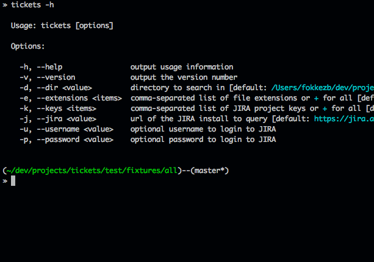

# Tickets [](http://gruntjs.com/)

A [node.js](http://nodejs.org/) API module and CLI for searching your code for references to [JIRA](https://www.atlassian.com/software/jira) tickets and looking up their status so you can take action.

I use this after each new release of Appcelerator's [Titanium](http://www.appcelerator.com/titanium/) to see if it fixes issues I have worked around in my code. This is also where the defaults for this module come from. However, you can override any of them easily.

Make it a habbit to refer to issues you report or run into so you can simply run this CLI after every new release to see what workarounds you can remove!

## Example

A screencast showing the CLI in action:




## Install [](http://badge.fury.io/js/tickets)

```
$ sudo npm install -g tickets
```

### API

You can also use tickets as a module. It exports just a single function which you can call with an object containing any of the options and a callback to receive the error or found issues.

```
var tickets = require('tickets');

tickets({
	dir: 'my/dir',
	extensions: 'js',		// takes both CSV or
	keys: ['FOO', 'BAR']	// Array

}, function (err, issues) {
	
	issues.forEach(function(issue) {
		console.log('Key: ' + issue.key);
		console.log('Files:');
		
		issue.files.forEach(function(lines, file) {
			console.log(file + ' #' + lines.join(', #'));
		});

		console.log('JIRA fields:');
		console.log(JSON.stringify(issue.fields, null, '  '));
	});
	
});
```

## Options

Type `tickes -h` to see the options:

```
-d, --dir <value>         directory to search in [default: process.cwd()]
-e, --extensions <items>  comma-seperated list of file extensions or + for all
                          [default: js,jmk,tss,xml]]
-k, --keys <items>        comma-seperated list of JIRA project keys or + for all
                          [default: TIMOB,ALOY]
-j, --jira <value>        url of the JIRA install to query
                          [default: https://jira.appcelerator.org/]
-u, --username <value>    optional username to login to JIRA
-p, --password <value>    optional password to login to JIRA
```

## Tests [](https://travis-ci.org/FokkeZB/TiCons-CLI)

1. Install [node.js](http://nodejs.org/).
2. Install [grunt](http://gruntjs.com/): `[sudo] npm install -g grunt-cli`
3. Clone the repo: `git clone https://github.com/fokkezb/ticons-cli.git && cd ticons-cli && npm install`
4. Run tests: `grunt test`

## Issues

Please report issues and features requests in the repo's [issue tracker](https://github.com/fokkezb/ticons-cli/issues).

## License

Distributed under [MIT License](LICENSE).